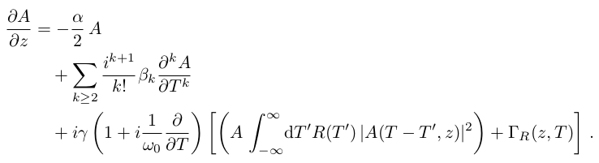
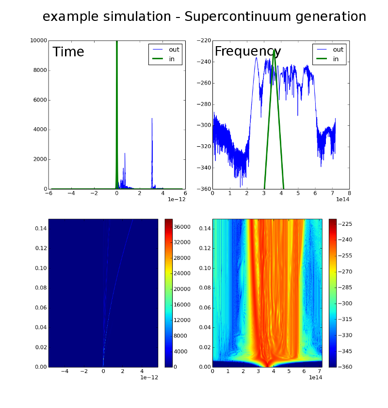

gnlse
=====
Rev 4, 12.03.2014

 * a python script to simulate the propagation of pulses in optical fibers
 * the generalized Nonlinear Schroedinger Equation (gNLSE) is modeled 

 * integration is done via SCIPYs ode solvers (adaptive stepsize)
 * it is derived from the RK4IP matlab script written by J.C.Travers, H. Frosz 
and J.M. Dudley that is provided in  "Supercontinuum Generation in Optical
 Fibers",  edited by J. M. Dudley and J. R. Taylor (Cambridge 2010).
 * see [http://scgbook.info/](http://scgbook.info/) for the original script.   

## available Demos (see **demos.py**):

* Raman shift (soliton self frequency shift)
* self-steepening
* higher-order soliton
* supercontinuum generation

## required python packages:

you will need recent **(!)** versions of 

* numpy
* scipy
* matplotlib not necessarily needed for simulation, but required for function 'inoutplot' 
* optictools like above only required by 'inoutplot', can be found on github/xmhk

have a look at [http://www.scipy.org/](http://www.scipy.org/) and grab the last stable version

## basic usage:

* again: **see demos.py**  ;)

1. use **prepare\_sim\_params()** to prepare a time and frequency grid, put in things like the fiber's dispersion, etc 
2. calculate your input field (in the time domain) 
2. use **perform\_simulation** to propagate your field
2. **saveoutput** can save the simulated data in a matlab-style file
3. **loadoutput** does the reverse thing
3. **inoutplot** can give you a quick overview (temporal and spectral in/output, false-color plot of temporal and spectral evolution)